# [Guided Interpretable Facial Expression Recognition via Spatial Action Unit Cues (FG2024)](https://arxiv.org/pdf/2402.00281.pdf)


by **Soufiane Belharbi<sup>1</sup>, Marco Pedersoli<sup>1</sup>, Alessandro Lameiras Koerich<sup>1</sup>, Simon Bacon<sup>2</sup>, Eric Granger<sup>1</sup>**

<sup>1</sup> LIVIA, Dept. of Systems Engineering, ÉTS, Montreal, Canada
<br/>
<sup>2</sup> Dept. of Health, Kinesiology \& Applied Physiology, Concordia University, Montreal, Canada

<p align="center">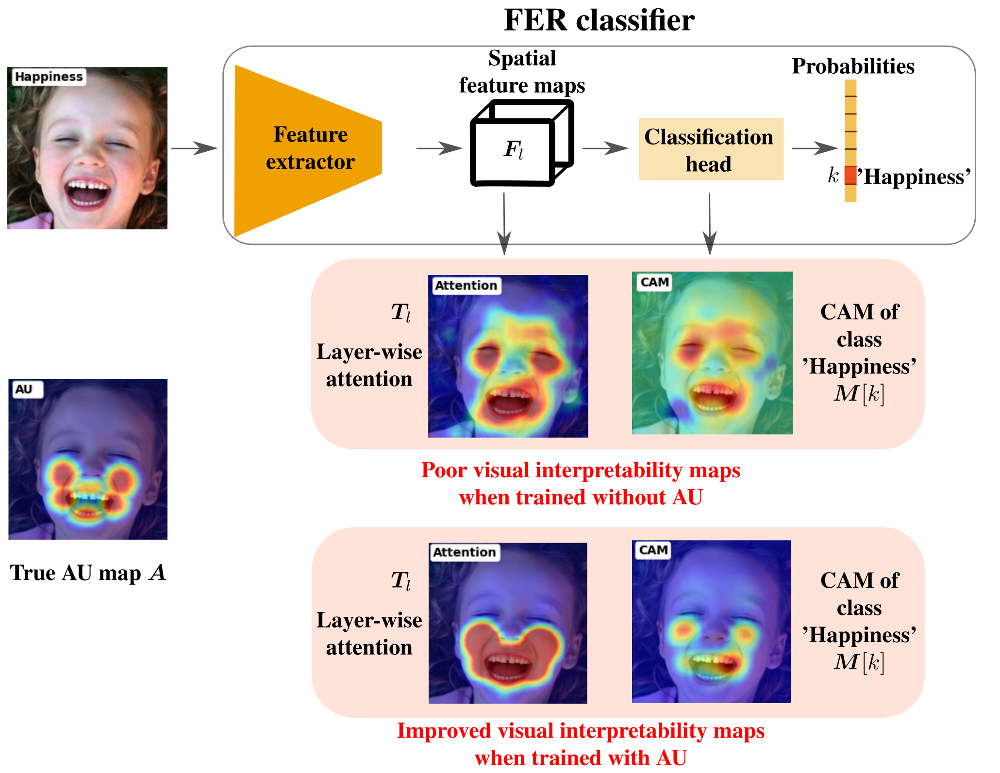</p>


## Abstract
Although state-of-the-art classifiers for facial expression recognition (FER) can achieve a high level of accuracy, they lack interpretability, an important feature for end-users.
Experts typically associate spatial action units (AU) from a codebook to facial regions for the visual interpretation of expressions.
In this paper, the same expert steps are followed. A new learning strategy is proposed to explicitly incorporate AU cues into classifier training, allowing to train deep interpretable models.
During training, this AU codebook is used, along with the input image expression label, and facial landmarks, to construct a AU heatmap that indicates the most discriminative image regions of interest w.r.t the facial expression. This valuable spatial cue is leveraged to train a deep interpretable classifier for FER.
This is achieved by constraining the spatial layer features of a classifier to be correlated with AU heatmaps. Using a composite loss, the classifier is trained to correctly classify an image while yielding interpretable visual layer-wise attention correlated with AU maps, simulating the expert decision process. Our strategy only relies on image class expression for supervision, without additional manual annotations. Our new strategy is generic, and can be applied to any deep CNN- or transformer-based classifier without requiring any architectural change or significant additional training time.
Our extensive evaluation on two public benchmarks RAFDB, and AFFECTNET datasets shows that our proposed strategy can improve layer-wise interpretability without degrading classification performance. In addition, we explore a common type of interpretable classifiers that rely on class activation mapping (CAM) methods, and show that our approach can also improve CAM interpretability.


**Code: Pytorch 2.0.0**

## Citation:
```
@InProceedings{belharbi24-fer-aus,
  title={Guided Interpretable Facial Expression Recognition via Spatial Action Unit Cues},
  author={Belharbi, S. and Pedersoli, M. and Koerich, A. L. and Bacon, S. and Granger, E.},
  booktitle={International Conference on Automatic Face and Gesture Recognition},
  year={2024}
}
```

## Content:
<!-- * [Overview](#overview) -->
* [Install](#reqs)
* [Datasets](#datasets)
* [Data preparation](#prep-data)
* [Run code](#run)
* [Pretrained weights (evaluation)](#weights)

<!-- ## <a name='overview'> Overview</a>: -->

<!-- 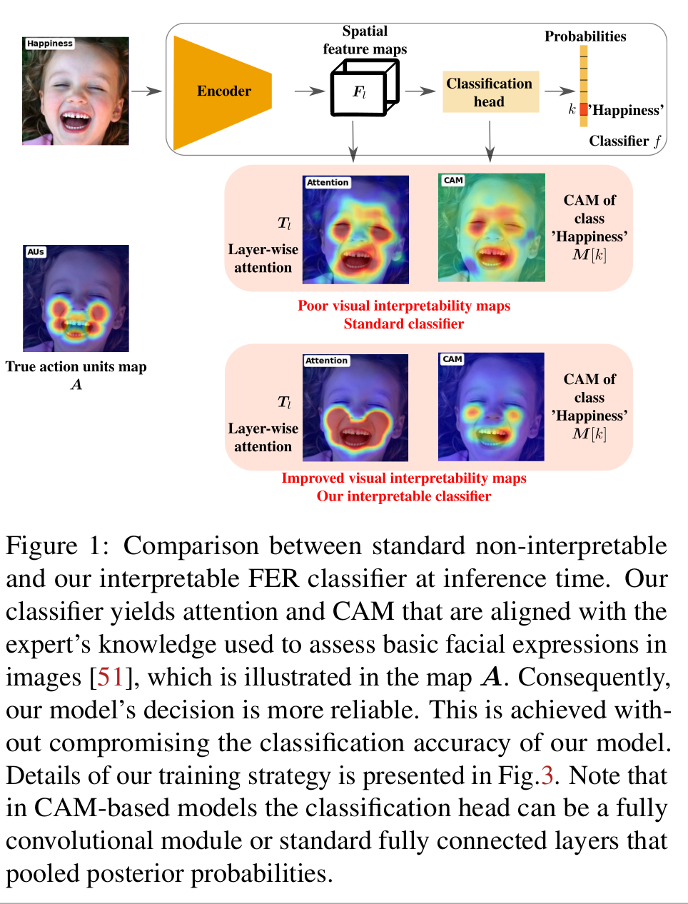
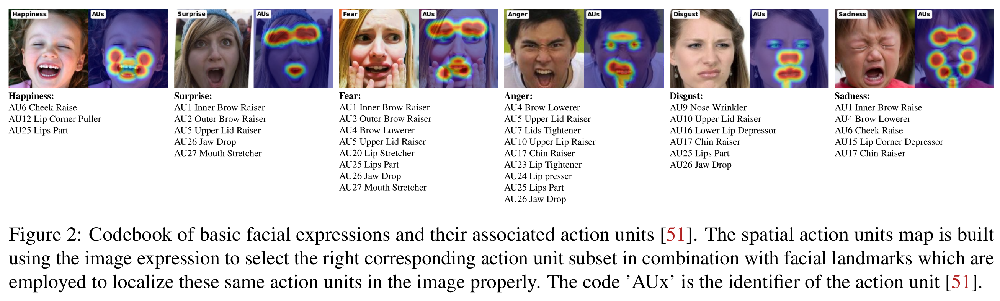
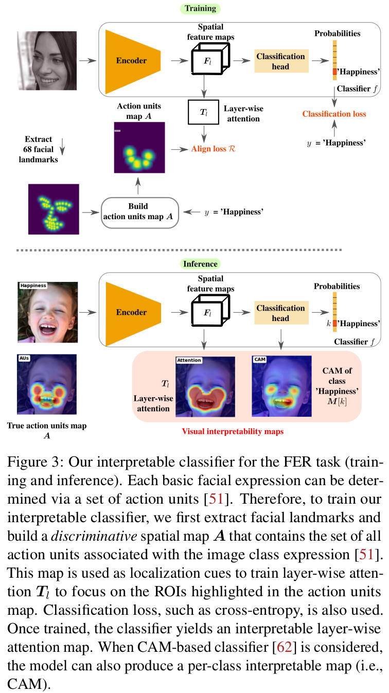
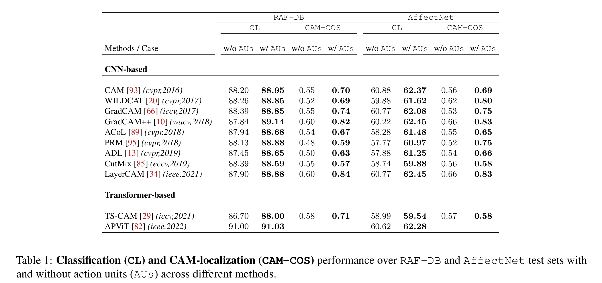
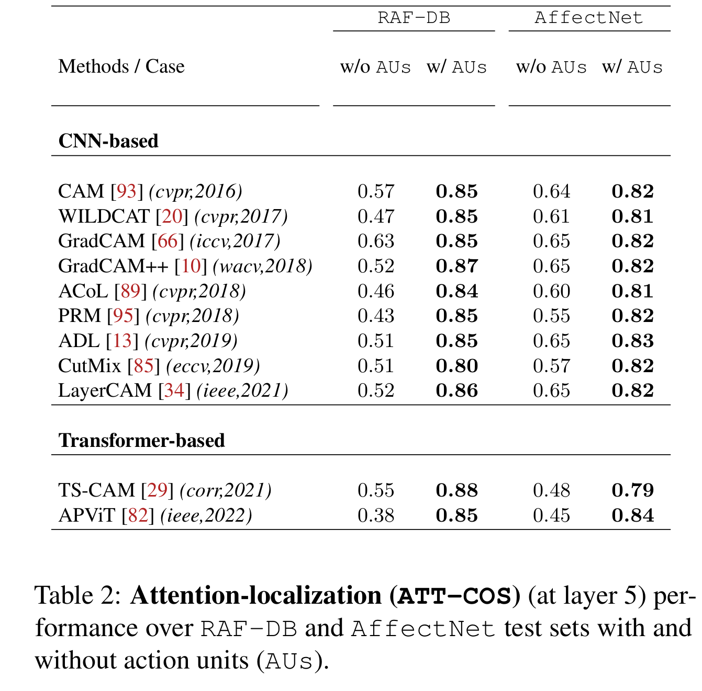
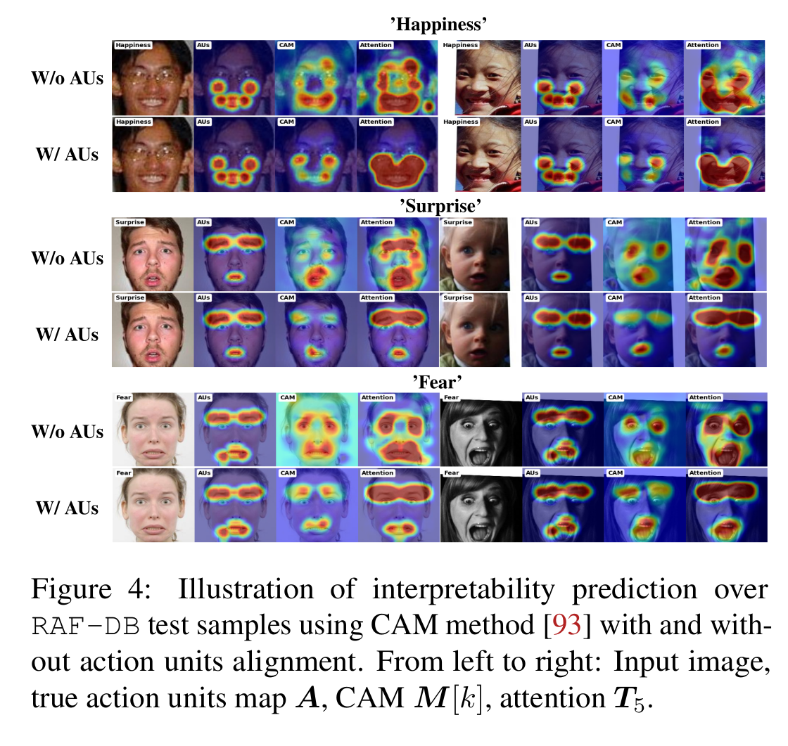
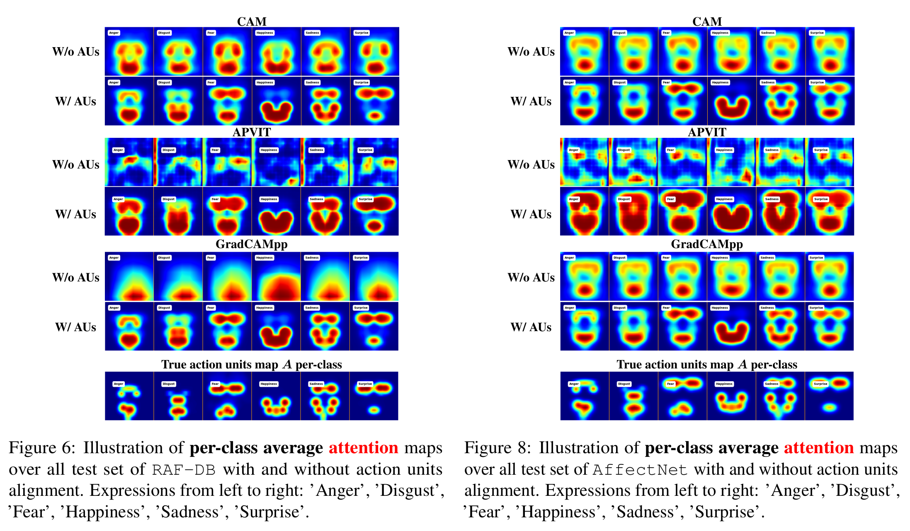
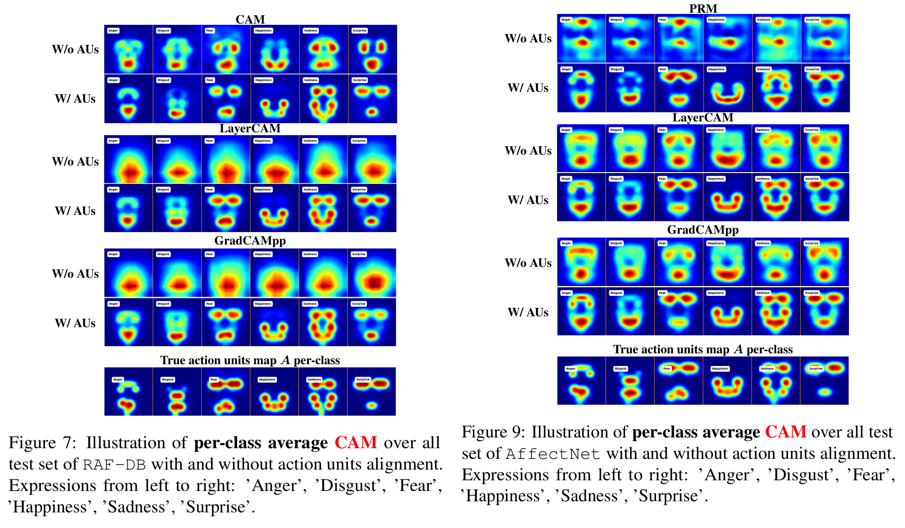
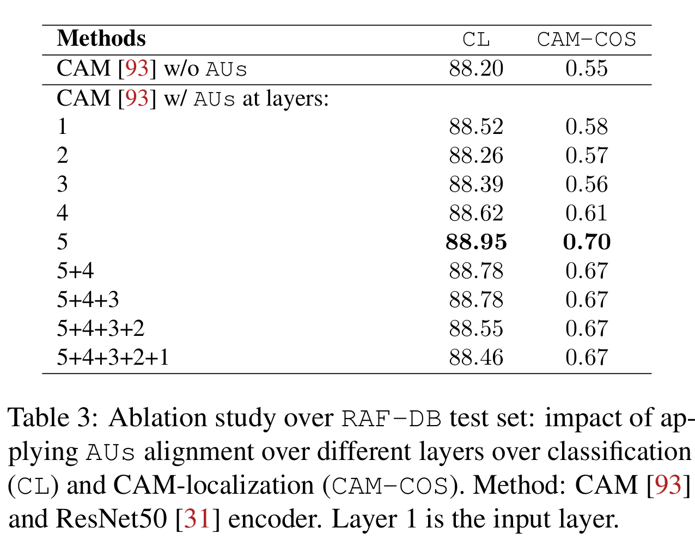
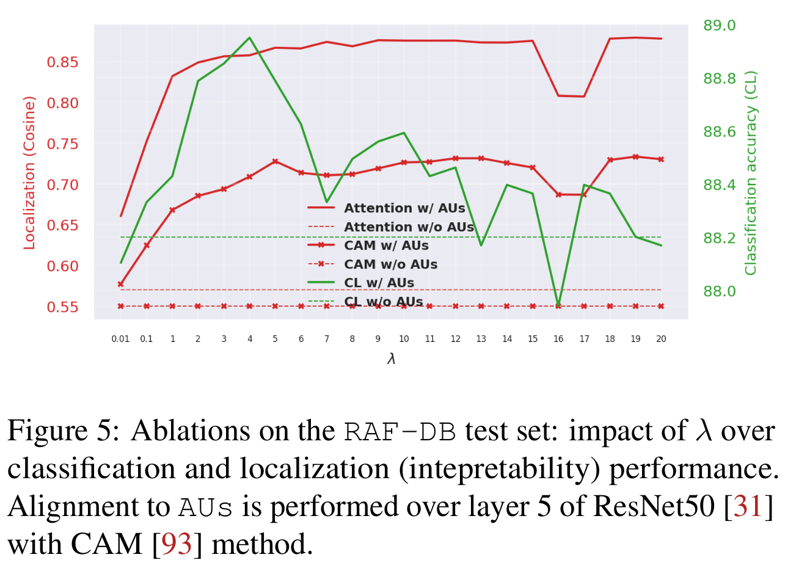 -->

## <a name='reqs'> Install</a>:

```bash
# Create a virtual env. env with conda
./create_env_conda.sh NAME_OF_THE_VIRTUAL_ENV
```

## <a name="datasets"> Download datasets </a>:
Download RAF-DB and AFFECTNET dataset.

Once you download the datasets, you need to adjust the paths in
[get_root_wsol_dataset()](dlib/utils/tools.py).

## <a name="prep-data"> Data preparation </a>:
- Create CSV folds to split data, crop/align faces:
```bash
  # RAF-DB, set:
  # crop_align = True
  # use_original_align = False
  # test_set_as_validset = True
  # already_cropped_aligned = False
  python dlib/datasets/raf_db.py

  # already set
  python dlib/datasets/affectnet.py
```
- Create facial landmarks:
```bash
  # create facial landmarks: set draw to False if you dont want to visual them
  python dlib/face_landmarks/landmarks.py --dataset RAF-DB --draw True
  python dlib/face_landmarks/landmarks.py --dataset AffectNet --draw True

  # Build and store facial landmarks heatmaps [optional]:
  python dlib/datasets/wsol_loader.py --dataset RAF-DB --action visualize
  python dlib/datasets/wsol_loader.py --dataset RAF-DB --action store

  python dlib/datasets/wsol_loader.py --dataset AffectNet --action visualize
  python dlib/datasets/wsol_loader.py --dataset AffectNet --action store
```
- Create action units maps [optional]:
```bash
  # build and store action units heatmaps

  # RAF-DB dataset
  # Visualization
  python dlib/face_landmarks/action_units.py --dataset RAF-DB --action visualize --aus_type heatmap_action_units_from_landmarks
  python dlib/face_landmarks/action_units.py --dataset RAF-DB --action visualize --aus_type heatmap_generic_action_units_from_landmarks

  # store action units
  python dlib/face_landmarks/action_units.py --dataset RAF-DB --action store --aus_type heatmap_action_units_from_landmarks
  python dlib/face_landmarks/action_units.py --dataset RAF-DB --action store --aus_type heatmap_generic_action_units_from_landmarks
  python dlib/face_landmarks/action_units.py --dataset RAF-DB --action store --aus_type heatmap_per_class_action_units_from_landmarks

  # AFFECTNET dataset: too much space... use offline or store only needed
  # Visualization
  python dlib/face_landmarks/action_units.py --dataset AffectNet --action visualize --aus_type heatmap_action_units_from_landmarks
  python dlib/face_landmarks/action_units.py --dataset AffectNet --action visualize --aus_type heatmap_generic_action_units_from_landmarks

  # store action units: needed. 70gb uncompressed.
  python dlib/face_landmarks/action_units.py --dataset AffectNet --action store --aus_type heatmap_action_units_from_landmarks

  python dlib/face_landmarks/action_units.py --dataset AffectNet --action store --aus_type heatmap_generic_action_units_from_landmarks
  python dlib/face_landmarks/action_units.py --dataset AffectNet --action store --aus_type heatmap_per_class_action_units_from_landmarks
```

## <a name="run"> Run code </a>:

* Vanilla CAM over AFFECTNET using ResNet50 (no action units loss):
```shell
  #!/usr/bin/env bash

  CONDA_BASE=$(conda info --base)
  source $CONDA_BASE/etc/profile.d/conda.sh
  conda activate fer

  # ==============================================================================
  cudaid=$1
  export CUDA_VISIBLE_DEVICES=$cudaid

  getfreeport() {
  freeport=$(python -c 'import socket; s=socket.socket(); s.bind(("", 0)); print(s.getsockname()[1]); s.close()')
  }
  export OMP_NUM_THREADS=1
  export NCCL_BLOCKING_WAIT=1
  getfreeport
  torchrun --nnodes=1 --node_rank=0 --nproc_per_node=1 --master_port=$freeport main.py --local_world_size=1 \
         --task STD_CL \
         --master_selection_metric cl_accuracy \
         --encoder_name resnet50 \
         --crop_size 224 \
         --resize_size 256 \
         --arch STDClassifier \
         --eval_batch_size 64 \
         --freeze_cl False \
         --support_background False \
         --method CAM \
         --dataset AffectNet \
         --box_v2_metric False \
         --cudaid $cudaid \
         --debug_subfolder FG_FER \
         --amp True \
         --elb_init_t 1.0 \
         --elb_max_t 10.0 \
         --elb_mulcoef 1.01 \
         --std_cl_w_style cl_w_none \
         --data_weighted_sampler False \
         --opt__clipgrad 0.0 \
         --dense_dims None \
         --dense_dropout 0.0 \
         --spatial_dropout 0.0 \
         --opt__lr 0.002 \
         --opt__lr_classifier_ratio 1.0 \
         --max_epochs 20 \
         --valid_freq_mb 0.0437 \
         --opt__step_size 4 \
         --opt__gamma 0.9 \
         --opt__name_optimizer sgd \
         --opt__weight_decay 0.0005 \
         --encoder_weights imagenet \
         --spatial_pooling WGAP \
         --batch_size 224 \
         --train_daug_mask_img_heatmap False \
         --eval_daug_mask_img_heatmap False \
         --large_maps True \
         --do_segmentation False \
         --aus_seg False \
         --ce True \
         --ce_lambda 1.0 \
         --ce_label_smoothing 0.0 \
         --align_atten_to_heatmap False \
         --oc_mean False \
         --oc_var False \
         --oc_unim_inq False \
         --att_sz False \
         --att_ent_sz False \
         --att_ent_lambda 0.1 \
         --ortho_lw False \
         --sparse_lf False \
         --sparse_lw False \
         --sparse_at False \
         --s_cost_s False \
         --high_entropy False \
         --w_sparsity False \
         --curriculum_l False \
         --con_scores False \
         --mse False \
         --mae False \
         --mtl_focal False \
         --free_orth_ft False \
         --guid_orth_ft False \
         --exp_id 01_26_2024_15_18_49_175665__1451211
```

* CAM + action units loss over AFFECTNET using ResNet50:
```bash
  #!/usr/bin/env bash

  CONDA_BASE=$(conda info --base)
  source $CONDA_BASE/etc/profile.d/conda.sh
  conda activate fer

  # ==============================================================================
  cudaid=$1
  export CUDA_VISIBLE_DEVICES=$cudaid

  getfreeport() {
  freeport=$(python -c 'import socket; s=socket.socket(); s.bind(("", 0)); print(s.getsockname()[1]); s.close()')
  }
  export OMP_NUM_THREADS=1
  export NCCL_BLOCKING_WAIT=1
  getfreeport
  torchrun --nnodes=1 --node_rank=0 --nproc_per_node=1 --master_port=$freeport main.py --local_world_size=1 \
         --task STD_CL \
         --master_selection_metric cl_accuracy \
         --encoder_name resnet50 \
         --crop_size 224 \
         --resize_size 256 \
         --arch STDClassifier \
         --eval_batch_size 64 \
         --freeze_cl False \
         --support_background False \
         --method CAM \
         --dataset AffectNet \
         --box_v2_metric False \
         --cudaid $cudaid \
         --debug_subfolder FG_FER \
         --amp True \
         --elb_init_t 1.0 \
         --elb_max_t 10.0 \
         --elb_mulcoef 1.01 \
         --std_cl_w_style cl_w_none \
         --data_weighted_sampler False \
         --opt__clipgrad 0.0 \
         --dense_dims None \
         --dense_dropout 0.0 \
         --spatial_dropout 0.0 \
         --opt__lr 0.002 \
         --opt__lr_classifier_ratio 1.0 \
         --max_epochs 20 \
         --valid_freq_mb 0.0437 \
         --opt__step_size 4 \
         --opt__gamma 0.9 \
         --opt__name_optimizer sgd \
         --opt__weight_decay 0.0005 \
         --encoder_weights imagenet \
         --spatial_pooling WGAP \
         --batch_size 224 \
         --train_daug_mask_img_heatmap False \
         --eval_daug_mask_img_heatmap False \
         --large_maps True \
         --do_segmentation False \
         --aus_seg False \
         --ce True \
         --ce_lambda 1.0 \
         --ce_label_smoothing 0.0 \
         --align_atten_to_heatmap True \
         --align_atten_to_heatmap_type_heatmap heatmap_action_units_from_landmarks \
         --align_atten_to_heatmap_normalize True \
         --align_atten_to_heatmap_jaw False \
         --align_atten_to_heatmap_lndmk_variance 64.0 \
         --align_atten_to_heatmap_aus_seg_full True \
         --align_atten_to_heatmap_layers 5 \
         --align_atten_to_heatmap_align_type random_avg \
         --align_atten_to_heatmap_norm_att norm_none \
         --align_atten_to_heatmap_p 1.0 \
         --align_atten_to_heatmap_q 1.0 \
         --align_atten_to_heatmap_loss cosine \
         --align_atten_to_heatmap_elb False \
         --align_atten_to_heatmap_lambda 9.0 \
         --align_atten_to_heatmap_scale_to scale_to_attention \
         --align_atten_to_heatmap_use_precomputed False \
         --align_atten_to_heatmap_use_self_atten False \
         --oc_mean False \
         --oc_var False \
         --oc_unim_inq False \
         --att_sz False \
         --att_ent_sz False \
         --att_ent_lambda 0.1 \
         --ortho_lw False \
         --sparse_lf False \
         --sparse_lw False \
         --sparse_at False \
         --s_cost_s False \
         --high_entropy False \
         --w_sparsity False \
         --curriculum_l False \
         --con_scores False \
         --mse False \
         --mae False \
         --mtl_focal False \
         --free_orth_ft False \
         --guid_orth_ft False \
         --exp_id 01_26_2024_15_19_40_248783__324660
```

## <a name="weights"> Pretrained weights (evaluation) </a>:
We provide the weights for all the models (44 weights: 2 datasets (RAF-DB, AffecNet) x 11 methods x 2 [with/without AUs]). Weights can be found at [Hugging Face](https://huggingface.co/sbelharbi/interpretable-fer-aus) in the file [shared-trained-models.tar.gz](https://huggingface.co/sbelharbi/interpretable-fer-aus/resolve/main/folds.tar.gz?download=true).
To run a single case:
```bash
python eval.py --cudaid 0 --split test --checkpoint_type best --exp_path $rootdir/shared-trained-models/FG_FER/AffectNet/resnet50/STD_CL/CAM/align_atten_to_heatmap_True/AffectNet-resnet50-CAM-WGAP-cp_best-boxv2_False
```
To run all 44 cases:
```bash
./eval_all.sh 0
```
To evaluate a single image only, you can use:
```bash
python single_img_eval.py --cudaid 0 --checkpoint_type best --exp_path $rootdir/shared-trained-models/FG_FER/RAF-DB/resnet50/STD_CL/CAM/align_atten_to_heatmap_True/RAF-DB-resnet50-CAM-WGAP-cp_best-boxv2_False
```

The provided weights can be used to reproduce the classification and localization performance reported in the paper in this table:
<p align="center">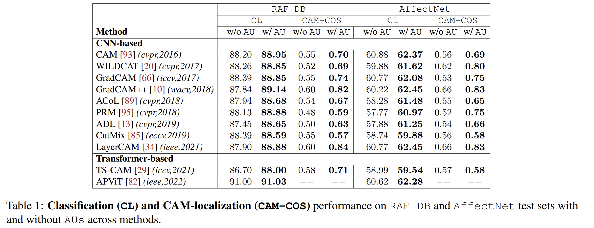</p>

We also provide the folds and the facial landmarks in [Hugging Face](https://huggingface.co/sbelharbi/interpretable-fer-aus) in the file [folds.tar.gz](https://huggingface.co/sbelharbi/interpretable-fer-aus/resolve/main/folds.tar.gz?download=true). For RAF-DB dataset, you need to crop and align the dataset using this code (see above in the readme) so the facial landmarks match. For AffectNet, you can use the provided version of the dataset.

Decompress both files into the root of this repository.
